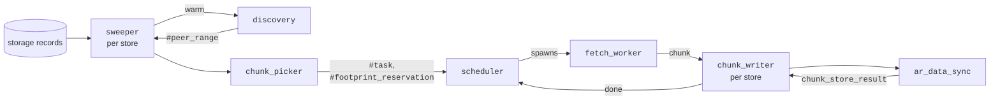

# arweave_sync

Fetches from peers the chunks that the node's storage modules are missing, and
hands them to the node's storage writer. It is a service app.

This README explains how `arweave_sync` works. Use it to find your way around
the code. Module docs and comments hold the details and tuning values.

## Public interface

- [`arweave_sync`](src/arweave_sync.erl) is the only public module.
- [`include/arweave_sync.hrl`](include/arweave_sync.hrl) holds the records and
  peer-protocol limits that the node and
  [`arweave_storage`](../arweave_storage/src/arweave_storage.erl) share with
  `arweave_sync`, such as the largest sync bucket payload.
- Test builds add `internal_*` functions, guarded by `AR_TEST`.

## Overview



A missing chunk is synced in five phases:

1. **Local sweep** finds what each storage module is missing
   ([`sweeper`](src/arweave_sync_sweeper.erl)).
2. **Peer availability** finds which peers have it
   ([`discovery`](src/arweave_sync_discovery.erl)).
3. **Matching** turns unsynced chunks and peer availability into units of work,
   claimed for the store ([`chunk_picker`](src/arweave_sync_chunk_picker.erl)).
4. **Scheduling** decides which store's work goes to which peer, and when
   ([`scheduler`](src/arweave_sync_scheduler.erl)).
5. **Fetch and write** download, validate and unpack each chunk and hand it to
   storage ([`fetch_worker`](src/arweave_sync_fetch_worker.erl),
   [`chunk_writer`](src/arweave_sync_chunk_writer.erl)).

No phase waits for the next one to succeed. If a chunk is not stored this time,
for any reason, the storage records still show it as missing and the next sweep
finds it again. There is no separate retry queue.

### Two kinds of source: bytes and footprints

Peers advertise their data in two forms, and `arweave_sync` has a mode for
each.

- **Byte mode.** Peers advertise byte ranges. Each chunk can be requested on
  its own, from any peer whose ranges cover it.
- **Footprint mode.** Peers that store replica.2.9 data advertise footprints.
  - A footprint is the set of chunks packed with the same 256 MiB of entropy:
    1024 chunks on mainnet.
  - A peer packs its chunks with its own entropy, so unpacking them means
    generating that peer's entropy for the footprint. This is expensive.
  - `arweave_sync` therefore fetches a footprint's chunks from one peer while
    that entropy is cached, and limits how many footprints are in progress at
    once.

Both modes can describe the same chunks. Each chunk is claimed once, so it is
fetched once whichever mode found it.

### Terms

The module docs use these terms for the work:

- **Unit of work:** a task (one chunk to fetch) or a footprint reservation
  (the unsynced chunks of one footprint).
- **Source:** a peer that can serve a unit of work, with the chunk intervals
  it serves for it (`#task_source`). A task's sources are the peers whose
  byte ranges cover its chunk; a footprint reservation's sources are the peers
  that advertise its footprint.
- **Claim:** a store's hold on the chunks a unit of work covers, so that no
  one else fetches them for the store.
- **Work queue:** a store's claimed units of work that are not yet bound to a
  peer.
- **Peer queue:** the tasks bound to one peer, waiting to be fetched.
- **Dispatch pass:** one round of the scheduler deciding what to fetch next.
  After each event that adds work or frees up room, and on each tick, the
  scheduler reads the current state of the stores, peer queues, entropy slots,
  chunk cache and download limit, and works out which units of work to bind
  to which peers and which fetches to start.
- **Plan:** a dispatch pass's working copy of the store, footprint and peer
  state. The pass updates the plan as it binds units of work to peers and
  picks the tasks to fetch. Then it commits the plan: it spawns a fetch worker
  for each of those tasks and writes the changes back.

And these for the measures and limits that balance the bottlenecks (see
[How the balancing works](#how-the-balancing-works)):

- **Goodput:** the primary measure of a peer's performance: the chunk bytes the
  peer delivered over a period of time. Each tick gives one **goodput sample**:
  the bytes fetched from the peer since the previous tick, over the time
  elapsed. As in BitTorrent's peer selection, `arweave_sync` judges a peer by
  the useful data it delivers rather than by raw throughput or latency.
- **Concurrency cap:** how many fetches `arweave_sync` runs against one peer at
  once, set from that peer's goodput and failures.
- **Write rate:** how many chunks per second a store writes. It sets the
  store's claim, cache and pipeline limits.
- **Chunk cache:** the node's shared memory for chunks between fetch and
  write. Each chunk reserves room in it for its fetched, unpacked and packed
  forms. Each store with work gets a fair share of it.
- **Entropy slot:** room for one footprint's entropy in the entropy cache.
- **Download limit:** the node-wide byte budget for fetches, set by
  `sync.max_download_rate`.
- **Driven:** a resource is driven while it always has work waiting, so that
  the resource itself, not its supply of work, sets the pace. Only a
  measurement taken while a resource is driven shows its capacity. For
  example, a peer is driven while tasks wait in its peer queue and it is at
  its concurrency cap: its goodput then shows what the peer can deliver,
  rather than how much work happened to be assigned to it.

## Phases

### 1. Local sweep

[`arweave_sync_sweeper`](src/arweave_sync_sweeper.erl) runs one sweeper per
storage module. Each one walks its module's range in two modes, each with its
own cursor ([`arweave_sync_cursor`](src/arweave_sync_cursor.erl)):

- **Byte:** one 1 GB step of the byte records at a time.
- **Footprint:** one footprint at a time.

A module's unsynced chunks are the chunks it is missing, minus blacklisted
data.

Each sweep step runs:

1. **Readahead.** The sweeper queues the next few ranges the store is missing
   and asks discovery to warm them: to fetch their peer metadata, so that it
   loads while earlier ranges are claimed.
2. **Claim.** Once discovery has had a moment to fetch a range's metadata, the
   sweeper hands the range to the chunk picker.

When both cursors reach the end, the sweeper pauses briefly and starts again
from the beginning.

The sweep runs only when all of these hold:

- `arweave_sync` is enabled: `sync.max_download_rate` is not 0.
- The module's device is in sync mode.
  [`ar_device_lock`](../arweave/src/ar_device_lock.erl) gives each device one
  mode at a time. While any module on a device prepares entropy or repacks,
  every module on that device waits.
- The node has joined, and the weave size and disk-pool threshold are known.
- The module's footprint record is initialized.
- There is enough free disk space.

### 2. Peer availability

[`arweave_sync_discovery`](src/arweave_sync_discovery.erl) keeps two tiers of
peer metadata in ETS tables.

**Coarse: sync buckets.** How much of each region (roughly 10 GB) the peer
holds.

- Buckets are refreshed about hourly, and dropped when a peer stops advertising
  them.
- They answer "who might have data near this offset".
- For each sweep range, only peers whose buckets cover the range are asked
  for its chunk intervals.

**Detailed: chunk intervals.** When a sweeper warms a range, as it queues the
range and again as it claims it, discovery fetches the exact intervals each of
those peers holds there: `/data_sync_record` for byte peers, `/footprints` for
footprint peers.

### 3. Matching

[`arweave_sync_chunk_picker`](src/arweave_sync_chunk_picker.erl) runs in the
sweeper's process:

1. It asks the scheduler how many more chunks the store may claim (the
   admission headroom), and stops if the answer is none.
2. It intersects each peer's ranges with the store's unsynced chunks in the
   range.
3. It builds units of work from the result: a footprint reservation for each
   footprint, and a task for each chunk that byte peers serve.
4. It offers the units to the scheduler, which claims them for the store.

Claiming follows these rules:

- A chunk that is already claimed is skipped.
- A store accepts work only up to its claim limit (see
  [Each store's write throughput](#each-stores-write-throughput)).
- A footprint reservation claims its whole footprint until it binds to a peer;
  after that, only the chunks it hands to the peer stay claimed.
- When a store has no room to claim a new footprint, the footprint is skipped
  rather than holding up the sweep. A later sweep offers it again.

### 4. Scheduling

[`arweave_sync_scheduler`](src/arweave_sync_scheduler.erl) is a single process
that decides which chunks to fetch from which peers, starts those fetches, and
follows each one until its store writes the chunk. Each resource it schedules
is modeled by its own module, which defines that resource's state and the rules
for changing it. The scheduler keeps each module's state and calls the module
to make its decisions:

- [`arweave_sync_store`](src/arweave_sync_store.erl): each store's work queue,
  claims, write rate and limits;
- [`arweave_sync_peer`](src/arweave_sync_peer.erl): peer queues, limits and
  source selection, with
  [`arweave_sync_peer_cap`](src/arweave_sync_peer_cap.erl) setting each peer's
  concurrency cap;
- [`arweave_sync_footprint`](src/arweave_sync_footprint.erl): footprint
  reservations and entropy slots;
- [`arweave_sync_download_limit`](src/arweave_sync_download_limit.erl): the
  download limit.

[`arweave_sync_metrics`](src/arweave_sync_metrics.erl) publishes the metrics for
all of these.

Each chunk of a store's work moves through these stages:

| Stage | Where the chunk is |
|---|---|
| Queued | In the store's work queue, as a task or within a footprint reservation |
| Bound | In a peer queue as a task, waiting to be fetched |
| Fetching | Being downloaded by a fetch worker |
| Writing | Fetched and held in the chunk cache until the store writes it; the claim is held until the result arrives |

A footprint reservation moves through these states:

| State | What the reservation is doing |
|---|---|
| Queued | In the store's work queue, with the sources the sweeper last offered |
| Bound | Holding an entropy slot and bound to one peer; it turns its chunks into tasks in batches and keeps the rest for later batches |
| Draining | Giving up its slot to another footprint; its current tasks finish, but it creates no new ones |

A dispatch pass runs after each event that adds work or frees room, and on each
tick. A burst of events leads to a single pass. Each pass builds a plan:

1. **Bind.**
   - Take the next unit of work from the least loaded store that has room, and
     bind it to the least loaded peer that offers it. Repeat.
   - A footprint reservation first takes an entropy slot, or competes for one.
     Then it binds to one peer and moves a batch of its chunks into that
     peer's queue as tasks. A batch is at most the store's pipeline limit: big
     enough to use much of the footprint's cached entropy at once, small
     enough for the store to write the chunks as they arrive.
2. **Start.** Take tasks from the peer queues while the peer caps, the store
   cache limits, the download limit and the chunk cache allow.
3. **Refill.** Starting fetches takes tasks out of the peer queues, so bind
   more work to fill the room they left.
4. **Commit.** Spawn a fetch worker for each started task, and write the plan
   back.

The tick, every ten seconds, also samples each store's write rate, updates
each peer's cap and queue length, and publishes metrics.

### 5. Fetch and write

[`arweave_sync_fetch_worker`](src/arweave_sync_fetch_worker.erl) handles one
task:

1. It finds the first byte of the chunk that is neither synced nor
   blacklisted, and stops if there is none or the chunk cache is full.
2. It reserves room in the shared chunk cache, requests `/chunk2` from the
   bound peer, and hands the chunk and its reserved room to the chunk writer.
3. It reports the bytes fetched and how the time was spent.

[`arweave_sync_chunk_writer`](src/arweave_sync_chunk_writer.erl) runs one
process per store:

1. It validates the chunk and sends it to the packing server to be unpacked
   if needed.
2. It tells the scheduler the chunk is unpacked, which frees a footprint's
   entropy slot once its last chunk is done.
3. It sends recent chunks to the disk pool, and everything else to the store's
   writer in [`ar_data_sync`](../arweave/src/ar_data_sync.erl). The writer packs
   chunks to the store's packing and writes them in batches.

The write result completes the task and releases its claim. A failure is
counted and dropped, and the next sweep finds the chunk again.

## Resources `arweave_sync` has to balance

| Resource | Primary metrics | Managed by |
|---|---|---|
| [Local unsynced data](#local-unsynced-data) | Each store's unsynced ranges | [`sweeper`](src/arweave_sync_sweeper.erl), [`discovery`](src/arweave_sync_discovery.erl) |
| [Peer metadata requests](#peer-metadata-requests) | Discovery jobs in flight, per peer and store | [`discovery`](src/arweave_sync_discovery.erl) |
| [Each peer's throughput](#each-peers-throughput) | Goodput; failure pressure | [`peer`](src/arweave_sync_peer.erl), [`peer_cap`](src/arweave_sync_peer_cap.erl) |
| [Each peer's queue length](#each-peers-queue-length) | Recent goodput | [`peer`](src/arweave_sync_peer.erl) |
| [Download bandwidth](#download-bandwidth) | Bytes downloaded | [`download_limit`](src/arweave_sync_download_limit.erl) |
| [Chunk cache memory](#chunk-cache-memory) | Chunk cache size; each store's cached chunks | [`store`](src/arweave_sync_store.erl), [`fetch_worker`](src/arweave_sync_fetch_worker.erl) |
| [Entropy cache memory and generation CPU](#entropy-cache-memory-and-generation-cpu) | Entropy slots in use | [`footprint`](src/arweave_sync_footprint.erl) |
| [Packing and unpacking CPU](#packing-and-unpacking-cpu) | Chunk cache size and write rate, indirectly | [`ar_packing_server`](../arweave/src/ar_packing_server.erl), outside `arweave_sync` |
| [Each store's write throughput](#each-stores-write-throughput) | Write rate | [`store`](src/arweave_sync_store.erl), [`ar_device_lock`](../arweave/src/ar_device_lock.erl) |
| [Disk space](#disk-space) | Free disk space | [`sweeper`](src/arweave_sync_sweeper.erl), [`store`](src/arweave_sync_store.erl) |

## How the balancing works

Each resource in the table above is balanced on its own, as follows.

### Local unsynced data

Managed by [`sweeper`](src/arweave_sync_sweeper.erl) and
[`discovery`](src/arweave_sync_discovery.erl).

A storage module can be missing terabytes spread over many partitions, and
dozens of peers may hold parts of it. Fetching every peer's chunk intervals
for all of it up front would cost far more memory and requests than it is
worth, so `arweave_sync` looks only a short way ahead:

- Each sweeper keeps a short readahead queue per mode, and discovery warms only
  the ranges in it, fetching chunk intervals from the peers whose sync buckets
  cover them.
- Sync buckets cost little to keep for every peer, so they narrow the peers
  asked about a range before any detailed request is made.
- The chunk interval cache has a memory budget; the oldest rows go first.

### Peer metadata requests

Managed by [`discovery`](src/arweave_sync_discovery.erl).

Discovery runs metadata requests as jobs, spread across peers and stores and
bounded in number, so that metadata requests do not crowd out chunk fetches. A
job over the limit is dropped, and a later warm asks again.

### Each peer's throughput

Managed by [`peer`](src/arweave_sync_peer.erl) and
[`peer_cap`](src/arweave_sync_peer_cap.erl).

Each peer has a concurrency cap: the number of fetches `arweave_sync` keeps in
flight to it. There is no global cap; each peer's cap is controlled on its own.

**Probing** sets the cap: `arweave_sync` tries caps near the current one and
keeps the one that delivers the most goodput without failures. It probes only
while the peer is driven (work waits in its peer queue, it is at its
concurrency cap, and the download limit and chunk cache have room). A peer
that is not driven keeps its cap, because its goodput says nothing about what
more concurrency would give.

The probe reads two metrics:

- **Goodput** (see [Terms](#terms)). The probe measures the peer's goodput at
  its current cap, then tries a higher cap and keeps whichever delivers more.
  When the higher cap gains nothing, it tries a lower one. Goodput also sets
  the peer's queue length (see
  [Each peer's queue length](#each-peers-queue-length)).
- **Failure pressure:** the share of fetch time spent on rejections (429 and
  503), timeouts and client errors. Any pressure cuts the cap at once, whether
  or not the peer is driven, and probing starts again from the cut cap.
  Rejections do not count against the peer's reputation in
  [`ar_peers`](../arweave/src/ar_peers.erl).

**Memory.** Caps are remembered when a peer leaves the active set, so a
returning peer does not start from scratch.

### Each peer's queue length

Managed by [`peer`](src/arweave_sync_peer.erl).

Each peer's queue holds about four seconds of its goodput, averaged over its
last six samples with work in flight. Without this bound, a queue filled while
the peer was fast could hold hours of work once the peer slowed, and every
task in it would wait that long while other peers sat idle.

**Task limit.** The cap and the queue length together bound how many tasks the
peer can hold. A per-store target splits that limit across the stores the peer
serves; entropy slots spread its footprint work.

### Download bandwidth

Managed by [`download_limit`](src/arweave_sync_download_limit.erl).

`arweave_sync` tracks how much data it downloads and blocks new fetches once
it reaches `sync.max_download_rate`, which can be changed at runtime.

### Chunk cache memory

Managed by [`store`](src/arweave_sync_store.erl) and
[`fetch_worker`](src/arweave_sync_fetch_worker.erl).

[`ar_chunk_cache`](../arweave/src/ar_chunk_cache.erl) belongs to the node and is
shared with local copy, the disk pool, repacking and packing.

**Fair share.** Each store's cache and pipeline limits (see
[Each store's write throughput](#each-stores-write-throughput)) are capped by
its share of the chunk cache. The cache is split by max-min fairness among the
stores that have work: a store needing less than an even split keeps what it
needs, and the rest is divided among the others. The result is that a slow
store holds little of the cache and a fast store gets as much as it can write.

**Reserved room.** Each chunk reserves room for its fetched, unpacked and
packed forms:

1. The scheduler checks projected cache use before starting fetches.
2. Each fetch worker then reserves room. A fetch that cannot get room ends
   without counting against the peer.
3. The reserved room passes to the chunk writer, the store writer and the
   packing server.
4. The last holder frees it.

### Entropy cache memory and generation CPU

Managed by [`footprint`](src/arweave_sync_footprint.erl).

The entropy cache holds a fixed number of footprints' entropy, which sets how
many footprint reservations can be bound at once.

- A footprint reservation keeps its slot while any of its chunks are still in
  progress. Throughout that time it stays bound to one peer.
- When no slot is free, a waiting footprint competes with the weakest bound
  one. Footprint priority is defined in
  [`arweave_sync_footprint`](src/arweave_sync_footprint.erl).
- A winner takes an idle incumbent's slot at once. A busy incumbent drains
  instead: it finishes the chunks in progress, takes no new ones, and then
  releases the slot. The next sweep finds any unsynced chunks it leaves
  behind.

The aim is to spread slots across stores and towards good peers while avoiding
churn, because each swap throws away entropy that cost RandomX time to
generate.

### Packing and unpacking CPU

Managed by [`ar_packing_server`](../arweave/src/ar_packing_server.erl), outside
`arweave_sync`.

`arweave_sync` does not schedule packing work; the node's packing server does.
Slow packing shows up in two places `arweave_sync` already balances:

- A chunk keeps its room in the chunk cache until it is unpacked and written,
  so when the packing server falls behind, the cache fills and new fetches
  stop.
- The store writer packs each chunk before writing it, so slow packing lowers
  the store's write rate, and with it the store's limits.

### Each store's write throughput

Managed by [`store`](src/arweave_sync_store.erl) and
[`ar_device_lock`](../arweave/src/ar_device_lock.erl).

Writing is usually the slowest stage, so each store's admission follows how
fast that store actually writes.

**Write rate.** On each tick the scheduler updates each store's write rate
from the node's count of completed writes, which includes every producer, such
as local copy and the disk pool.
[`arweave_sync_store`](src/arweave_sync_store.erl) describes how the rate is
estimated.

**Limits.** The write rate sets three per-store limits:

- The **claim limit** caps how many of the store's unsynced chunks the
  sweeper can claim.
- The **cache limit** caps the store's chunks waiting in the chunk cache.
- The **pipeline limit** caps bound, fetching and cached chunks together. It
  covers a chunk's whole trip from fetch to write.

**Device locks.** [`ar_device_lock`](../arweave/src/ar_device_lock.erl) gives
each device one mode at a time. A store's sweep runs only while its device is
in sync mode, so entropy preparation or repacking on the same device pauses it.

### Disk space

Managed by [`sweeper`](src/arweave_sync_sweeper.erl) and
[`store`](src/arweave_sync_store.erl).

A store with too little free disk space takes no new work: its sweeper stops
claiming, and the scheduler starts no fetches for it.

### Choosing stores and peers

Managed by [`store`](src/arweave_sync_store.erl) and
[`peer`](src/arweave_sync_peer.erl).

Binding and starting fetches both spread work evenly, so that every store
keeps writing and no peer is overloaded while others sit idle:

- **Stores.** Binding takes work from the least-loaded store that has work and
  room for it.
- **Peers.** Each unit of work goes to its least-loaded source.
- **Fetches.** Fetches start on peers below their concurrency cap, first for
  the stores with the fewest fetches in flight.

The rankings are defined in [`arweave_sync_store`](src/arweave_sync_store.erl)
and [`arweave_sync_peer`](src/arweave_sync_peer.erl).

## Where problems tend to appear

**Symptom:** `sync_sweep_offset` stays flat while a store has missing data.
- The sweep is not producing work. Check its gates: device lock mode
  (`device_lock_status`), footprint record initialization, disk space, and a
  zero download rate.

**Symptom:** a store has unsynced chunks but few claims
(`sync_claimed_bytes_by_store`).
- Metadata is arriving too slowly. The sweeper gives discovery a fixed time to
  warm each range, then claims the range with whatever metadata has arrived.
  Chunks with no known source by then wait for the next sweep.

**Symptom:** most of a store's tasks are in the `writing` stage
(`sync_tasks_by_store`), and `sync_store_pipeline_limit_chunks` stays small.
- Writes are the bottleneck, and a low write rate keeps the store's limits
  small.
- Look for anything that distorts the write signal: batched writes, other
  producers writing to the same store, and repacking or entropy preparation on
  the same device.

**Symptom:** `chunk_cache_size` sits at `chunk_cache_size_limit`, and each
store's `chunk_cache_size_by_store` is small.
- The chunk cache is too small for the number of stores. Each store's share
  limits how many fetches it can have in flight, so per-store throughput
  becomes bound by peer latency.
- Raise `packing.cache_size` if the node has memory to spare.

**Symptom:** entropy generation is high (`replica_2_9_entropy_generated`, for
example hundreds of MiB/s) and so is the entropy cache miss ratio
(`cache_miss` against `cache_hit` in `replica_2_9_entropy_stats`), while sync
throughput stays low.
- Footprints are evicting each other's entropy and regenerating it, usually
  because there are more active stores than slots, or repacking shares the
  cache.
- On nodes syncing well, the miss ratio usually sits between about 1 in 100
  and 1 in 500, because a footprint often needs only some of its chunks: some
  are missing from peers, or were synced in an earlier run. It can never be
  better than 1 in 1024, one miss per entropy.
- The `redundant` stat counts entropy generated more than once, and
  `replica_2_9_entropy_reuse_count` shows how many chunks each entropy served
  before it was evicted.
- Compare `sync_active_footprints` with `sync_max_active_footprints`, and
  raise `packing.entropy.cache_size` for more slots.

**Symptom:** `sync_peer_failure_pressure` is high, and the affected peers'
`sync_peer_concurrency_cap` values have collapsed.
- Peers are rejecting requests, or requests are failing on the network. Break
  `http_client_get_chunk_duration_seconds` down by `status_class`: `429` comes
  from a peer's rate limits and `503` from a peer that cannot start a chunk
  read in time, while `timeout`, `connect_timeout` and connection errors point
  to the network.
- Any failure pressure cuts the cap, so even a small share of failed fetches
  keeps a peer's cap low.
- When only some peers are affected, `arweave_sync` moves work to the others.
  When every peer is affected, look at this node's own network: bandwidth,
  packet loss or connection limits.
- Rejections do not count against a peer's reputation in
  [`ar_peers`](../arweave/src/ar_peers.erl).

**Symptom:** a peer's `sync_peer_concurrency_cap` stays low although its
failure pressure is near zero.
- Caps grow only while a peer is driven, so a peer that another limit is
  starving never learns it could do more. Find that limit first.
- Caps adapt over minutes, not seconds.
- Compare with `sync_peer_goodput_bytes_per_second`. The
  `sync_peer_cap_decision` debug log event records every cap decision.

**Symptom:** a peer's fetches are slow
(`http_client_get_chunk_duration_seconds`) while its failure pressure stays
near zero.
- The limit may sit below the scheduler: the HTTP client's per-peer
  connection pool, or
  [`arweave_throttling`](../arweave_throttling/src/arweave_throttling.erl)'s
  request quotas.
- A throttling wait counts as fetch time, which the peer controller reads as
  low goodput.

**Symptom:** peers with tasks queued (`sync_tasks_by_peer` with stage
`queued`) have fewer fetches in flight (stage `fetching`) than their
`sync_peer_concurrency_cap`, even though the chunk cache and download limit
have room.
- Fetches are starting late. Check the `arweave_sync_scheduler` message queue
  (`process_info` with type `message_queue`, sampled only with `debug` on).
  Every dispatch pass runs in this one process, so when its queue backs up,
  peers sit idle while work waits.

**Symptom:** a change improves one setup but makes another worse. For example,
it speeds up syncing from a few fast peers but stalls a node whose peers rate
limit it, or it helps a node with one store but starves a node with more
stores than entropy slots.
- These controllers interact, so a fix for one setup often hurts another.
- Run [`arweave_sync_sim_SUITE`](test/arweave_sync_sim_SUITE.erl) for any
  change to allocation, limits, backpressure, ratings or scheduling. It runs
  the whole pipeline against modeled peers and disks in setups like these,
  using the simulator in [`arweave_sim`](../arweave_sim/README.md):

  ```sh
  ./bin/ct --suite apps/arweave_sync/test/arweave_sync_sim_SUITE.erl
  ```

## External dependencies

| Feature | Application | Description |
|---|---|---|
| Storage records | [`arweave_storage`](../arweave_storage/src/arweave_storage.erl) | The sync and footprint records and each store's info. `arweave_sync` reads them and never writes them. |
| Chunk writes | `arweave` ([`ar_data_sync`](../arweave/src/ar_data_sync.erl)) | Validates fetched chunks and stores them. |
| Disk pool | `arweave` ([`ar_disk_pool`](../arweave/src/ar_disk_pool.erl)) | Takes fetched chunks that end at or above the disk pool threshold. |
| Chunk cache | `arweave` ([`ar_chunk_cache`](../arweave/src/ar_chunk_cache.erl)) | The node's shared memory for chunks between fetch and write. |
| Packing | `arweave` ([`ar_packing_server`](../arweave/src/ar_packing_server.erl)) | Unpacks fetched packed chunks. |
| Blacklist | `arweave` ([`ar_tx_blacklist`](../arweave/src/ar_tx_blacklist.erl)) | Finds the next byte that is not blacklisted, so blacklisted data is never fetched. |
| Footprint limit | `arweave` ([`ar_footprint_limit`](../arweave/src/ar_footprint_limit.erl)) | Each store's footprint limit, which bounds its footprint sweep. |
| Device locks | `arweave` ([`ar_device_lock`](../arweave/src/ar_device_lock.erl)) | Gives each device one mode at a time. A store sweeps only while its device is in sync mode. |
| Peers | `arweave` ([`ar_peers`](../arweave/src/ar_peers.erl)) | The peer list, and peer ratings after each fetch. |
| HTTP client | `arweave` ([`ar_http_iface_client`](../arweave/src/ar_http_iface_client.erl)) | Requests for peers' sync buckets, sync and footprint records, and chunks. |
| Sync buckets | `arweave` ([`ar_sync_buckets`](../arweave/src/ar_sync_buckets.erl)) | Reads peers' sync buckets and the network bucket sizes. |
| Node state | `arweave` ([`ar_node`](../arweave/src/ar_node.erl)) | The weave size, and whether the node has joined the network. |
| Events | `arweave` ([`ar_events`](../arweave/src/ar_events.erl)) | Peer and node-state events for discovery. |
| Clock | `arweave` ([`ar_timer`](../arweave/src/ar_timer.erl)) | Monotonic time and timers. |
| Throttling | [`arweave_throttling`](../arweave_throttling/src/arweave_throttling.erl) | Whether a peer's request quota is used up. |
| Configuration | [`arweave_config`](../arweave_config/src/arweave_config.erl) | Options such as `sync.max_download_rate`, and the storage modules. |
| Metrics | [`arweave_metrics`](../arweave_metrics/src/arweave_metrics.erl) | Publishes the `arweave_sync` metrics. |
| Constants and geometry | [`arweave_lib`](../arweave_lib/README.md) | Protocol constants, interval sets, and the replica.2.9 and footprint geometry. |

`arweave_sync` calls `arweave_lib` directly and reaches every other
application through [`arweave_sync_deps`](src/arweave_sync_deps.erl), which
returns one module per dependency, so the simulator and the tests can
substitute their own.
[`arweave_lib_boundaries_SUITE`](../arweave_lib/test/arweave_lib_boundaries_SUITE.erl)
checks this rule. `arweave` depends on `arweave_sync`, not the other way round.

## Lifecycle

- **Start.** The application starts its root supervisor and tables early. Once
  the node's own services are up, the node calls
  [`arweave_sync:activate/0`](src/arweave_sync.erl). That starts discovery, the
  scheduler, and one chunk writer and one sweeper per storage module under a
  single supervisor. A store's sweep starts once local copying for that store
  completes.
- **Shutdown.** The node calls
  [`arweave_sync:deactivate/0`](src/arweave_sync.erl) before shutting storage
  down.
- **Restarts.** A crash in any runtime process restarts them all. Claims and
  peer caps start over, sweepers restore their bounds from the tables, and later
  sweeps find the chunks that were in flight. If a store's
  [`ar_data_sync`](../arweave/src/ar_data_sync.erl) process restarts, its chunk
  writer fails only the writes that process held, and later sweeps find those
  chunks again.

## Tests

```sh
./bin/ct --dir apps/arweave_sync/test
```

The suites cover:

- each controller on its own;
- the scheduler and sweeper, running real code against test stand-ins for the
  node's services;
- fetch-worker and chunk-writer outcomes;
- discovery;
- the app boundary.

None of them start a node.

The simulation suite,
[`arweave_sync_sim_SUITE`](test/arweave_sync_sim_SUITE.erl), runs the whole
pipeline against modeled peers and disks; see
[`apps/arweave_sim/README.md`](../arweave_sim/README.md).

Integration with the node is tested with EUnit in `arweave`, for example:

```sh
ARWEAVE_NAMESPACE=sync-restart ./bin/test ar_data_sync_restart_tests
ARWEAVE_NAMESPACE=sync-requests ./bin/test ar_data_sync_storage_requests_tests
```
